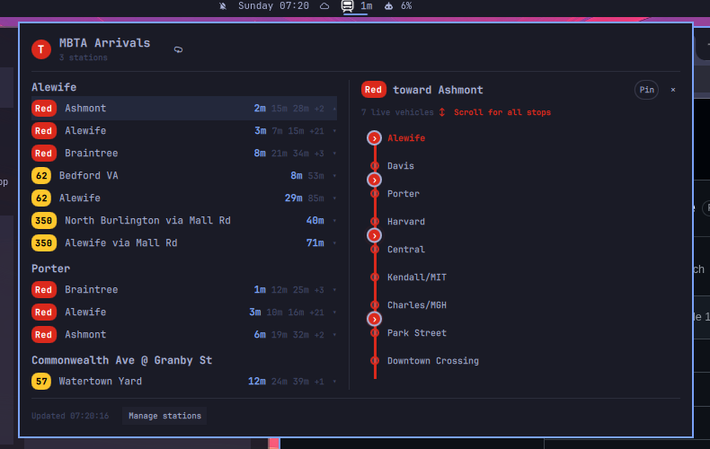

# MBTA for Omarchy

Live MBTA departure times in the Omarchy bar. A `T` badge with the next
departure across your stations; click it for a full departure board — subway,
Silver Line, bus, commuter rail, and ferry, with real-time countdowns and the
MBTA's official route colors.



## Install

```sh
omarchy plugin add https://github.com/cgaray/omarchy-MBTA.git --enable
```

## Usage

- **Bar pill** shows the next departure at any configured stop, or the exact
  station and destination row pinned from the panel. Middle/right click forces
  a refresh.
- **Click the pill** to open the board: departures grouped per station and
  route/direction, with one shared scrollable line map and live vehicle markers.
- **Pin** in the line pane makes that station and destination feed the bar
  countdown until it is unpinned.
- **Manage stations** opens the picker:
  - *By name* — search every station in the system ("Davis", "North Station").
  - *Near address* — type an address, place, or raw `lat,lon`, set a radius in
    km, and hit **Find**. **⌖ My location** skips typing: it prefers the
    coordinates saved by Omarchy's weather plugin, then falls back to an IP
    location lookup.
- Selected stations persist in shell.json (per-widget settings) and survive
  restarts.

Late at night, when real-time predictions go quiet, the board falls back to
scheduled times and says so in the footer.

Keyboard: `Esc` closes (clears the search field first), `Tab` switches panels,
`↑`/`↓`+`Enter` work inside both pickers.

## Configure

Everything lives in the widget's settings entry:

```sh
omarchy bar move io.github.cgaray.mbta --section right
```

| Setting | Default | What it does |
| --- | --- | --- |
| `stopIds` | Downtown Boston five | Stations on the board (the picker edits this) |
| `refreshSec` | 30 | Prediction fetch interval (15–300s) |
| `perGroupCap` | 3 | Countdown chips kept per route/direction row |
| `scheduleFallback` | true | Show scheduled times when predictions are empty |
| `pinnedLine` | empty | Internal station/line selection set by the panel's Pin control |

The plugin uses anonymous MBTA access and does not store API credentials.

## IPC

```sh
omarchy-shell io.github.cgaray.mbta toggle     # open/close the panel
omarchy-shell io.github.cgaray.mbta refresh    # force a fetch
omarchy-shell io.github.cgaray.mbta status     # JSON summary of the board
omarchy-shell shell summon io.github.cgaray.mbta '{}'
```

## Data sources

- [MBTA V3 API](https://www.mbta.com/developers/v3-api) — predictions,
  schedules, stops, geo search. No key required for light use.
- [OpenStreetMap Nominatim](https://nominatim.org/) — address → coordinates
  for the "near address" flow (sends an identifying User-Agent).
- `ipinfo.io/loc` — one-time IP location fallback when no saved location exists.

Predictions are requested at startup and every 15–300 seconds (30 seconds by
default). Empty predictions may trigger one bounded schedule request. An open
line view requests vehicles every 20 seconds. Address and IP-location requests
only occur after the corresponding user action.

Selected stop IDs, the optional pinned line, picker mode, radius, and last
typed address are retained in Omarchy's widget settings. The plugin reads the
weather plugin's saved location through a bounded regular-file check, but only
sends coordinates to MBTA after the user chooses My location. Removing the
plugin may leave its widget settings in Omarchy's shell configuration; clear
the saved address and pin in the panel before removal if desired.

Runtime dependencies: Python 3 and the standard library. Network responses are
fetched through the bundled allowlisted adapter with endpoint-specific byte
and time limits.

## Development

The repo is the plugin; sync it into place after edits:

```sh
./dev-sync.sh          # rsync into ~/.config/omarchy/plugins/io.github.cgaray.mbta
omarchy-restart-shell  # cold reload (rescanPlugins can serve stale QML)
journalctl --user -t omarchy-shell   # plugin QML errors land here
./tests/run.sh         # node tests + contract checks + qmllint
```

## Remove

```sh
omarchy plugin remove io.github.cgaray.mbta
```

## License

MIT — see [LICENSE](LICENSE).
